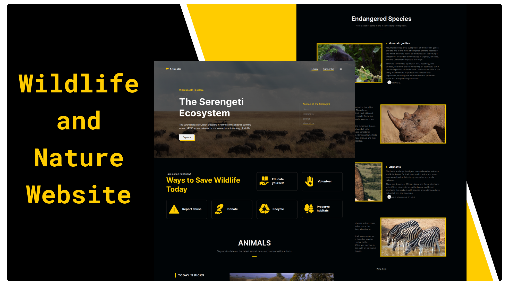
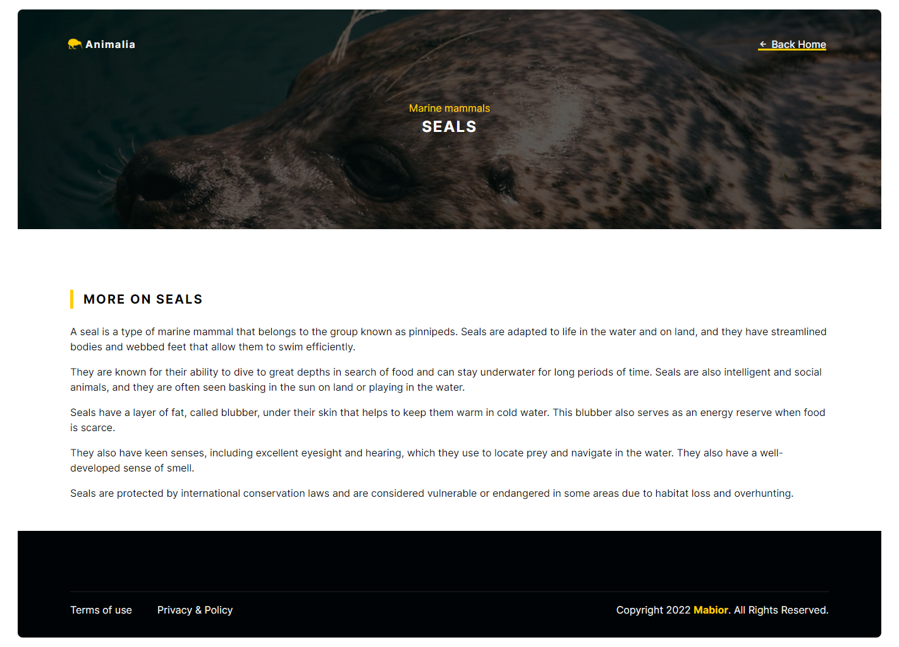

  
 
  
  <h2 align="center">Animalia - Wildlife and Animal Conservation.</h2>

  Built for educational purposes and for my interest in nature and wildlife. Enjoy exploring!
  
  Inspired by National Geographic

  <a href="https://animaliaa.netlify.app/"><strong>➥ Live Demo</strong></a>

### Preview

### Overview
- Developed using Mobile First Approach.
- Responsive on all devices.
- SEO optimized.

### Tools Used
- Boxicons (Icons): https://boxicons.com/
- Icons8 (Icons): https://icons8.com/
- Pexels (Images): https://www.pexels.com/
- Unsplash (Images): https://pixabay.com/
- Pixabay (Images): https://unsplash.com/
- ChatGPT (Information): https://chat.openai.com/
  
